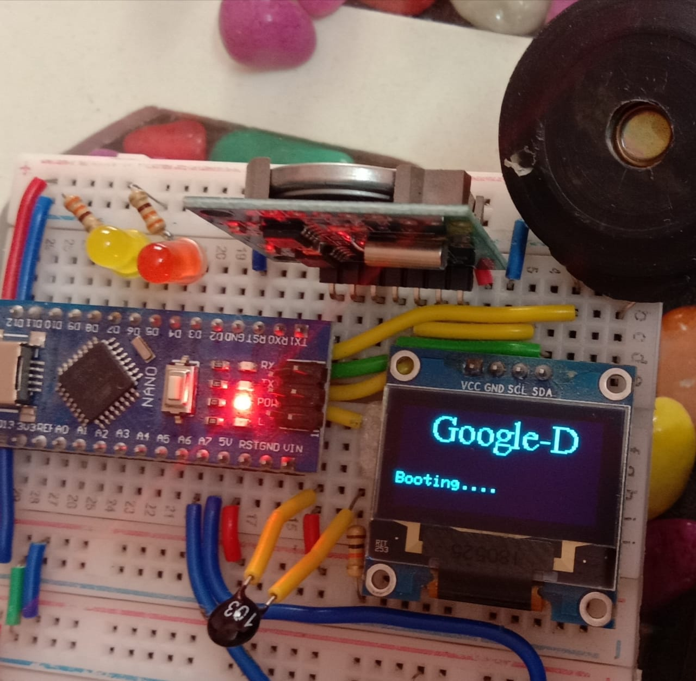
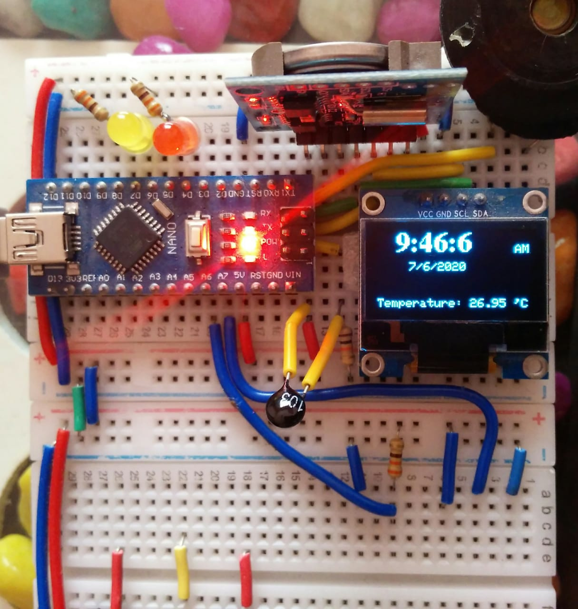

This My clock Project.

Component Required:-

- Arduino nano 
- RTC module (Tiny RTC I2c)
- OLED Display (I2C)
- Thermistor(100K)
- Resister (100ohm)
- Bradbord
- Small Speaker 

-------------------------------------------------------------------
 Connection Details:-
 
 Panding......................
 
 ------------------------------------------------------------------
 Output-1  (Booting Process)
 
 ---->
 

-------------------------------------------------------------------
Output-2  (Running mode)

-->

